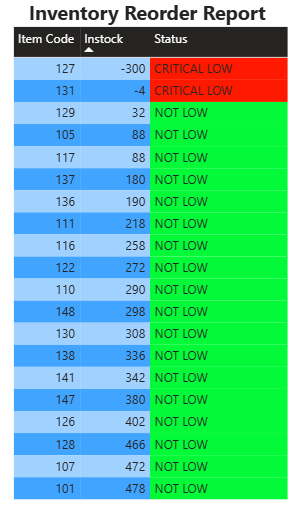

# Smart Stock: Automated Inventory Management System

**An end-to-end data solution to automate inventory tracking, improve data integrity, and visualize reorder points.**

##  Project Overview
Manual inventory tracking is prone to human error. I built this tool to:
1.  **Automate Data Entry:** Use Python to process daily transaction logs.
2.  **Ensure Data Integrity:** Store data in a structured PostgreSQL database.
3.  **Visualize Risks:** A Power BI dashboard that instantly flags "CRITICAL LOW" items using logic-based conditional formatting.

##  Tech Stack
* **Python:** Data cleaning and ETL (Extract, Transform, Load).
* **SQL (PostgreSQL):** Relational database storage and View creation.
* **Power BI:** Data visualization and "Traffic Light" alert system.

##  Project Structure
* `inventory_manager.py`: The main script that processes daily sales/restock data.
* `schema.sql`: Database schema including the `stock_dashboard` view logic.
* `dashboard_preview.png`: Snapshot of the live report.

##  Business Logic (The "Traffic Light" System)
The system calculates real-time stock and assigns a status:
* 🔴 **CRITICAL LOW (< 0):** Flags negative numbers indicating missed "Restock" invoices (Data Error).
* 🟡 **REORDER NOW (< 15):** Flags items nearing depletion.
* 🟢 **HEALTHY (> 15):** Stock levels are sufficient.

## 🚀 How to Run
1.  Install dependencies: `pip install -r requirements.txt`
2.  Set up the PostgreSQL database using `schema.sql`.
3.  Run the script: `python main.py`  <-- CHANGED THIS
4.  Connect Power BI with PostgreSQL
